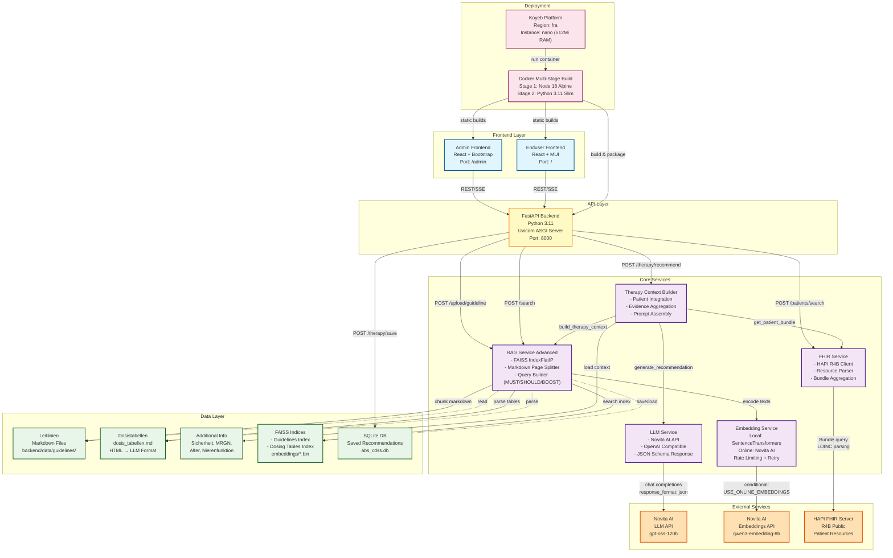
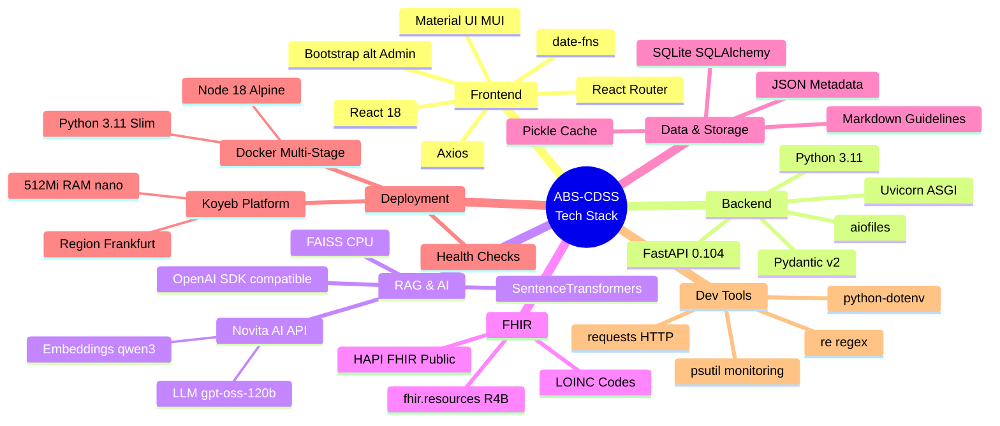
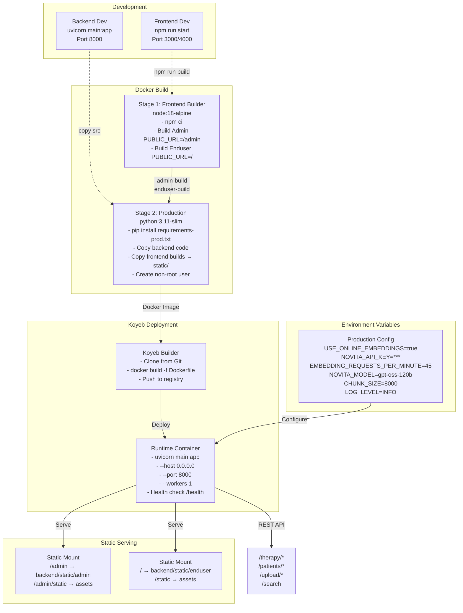
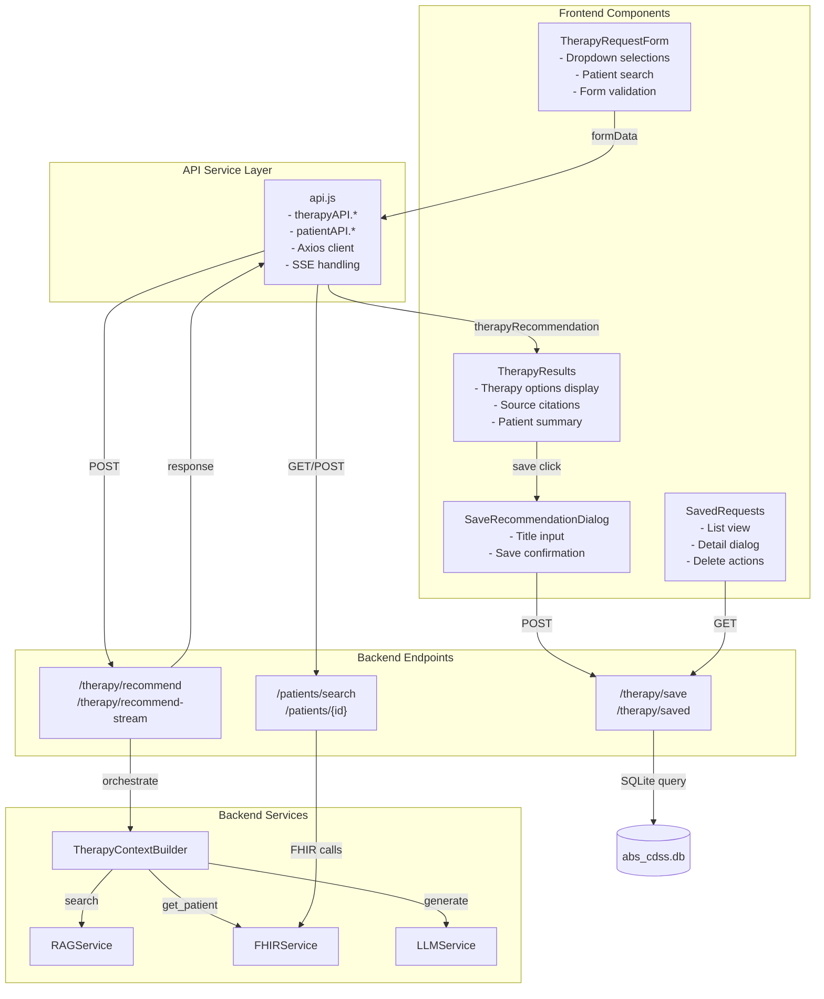
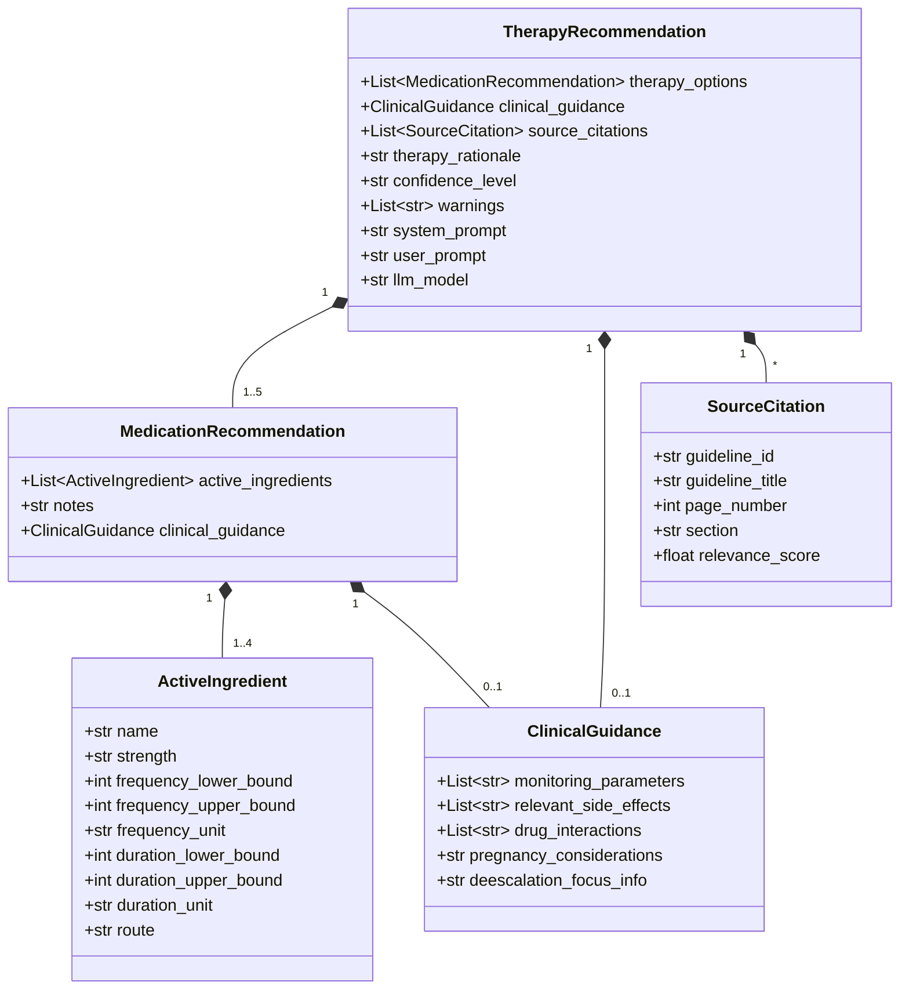
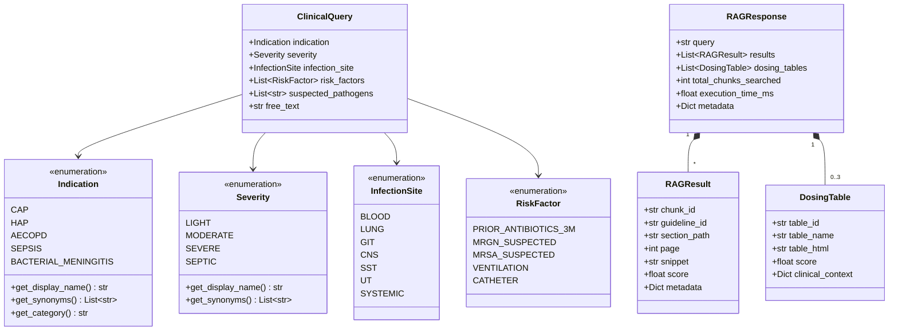
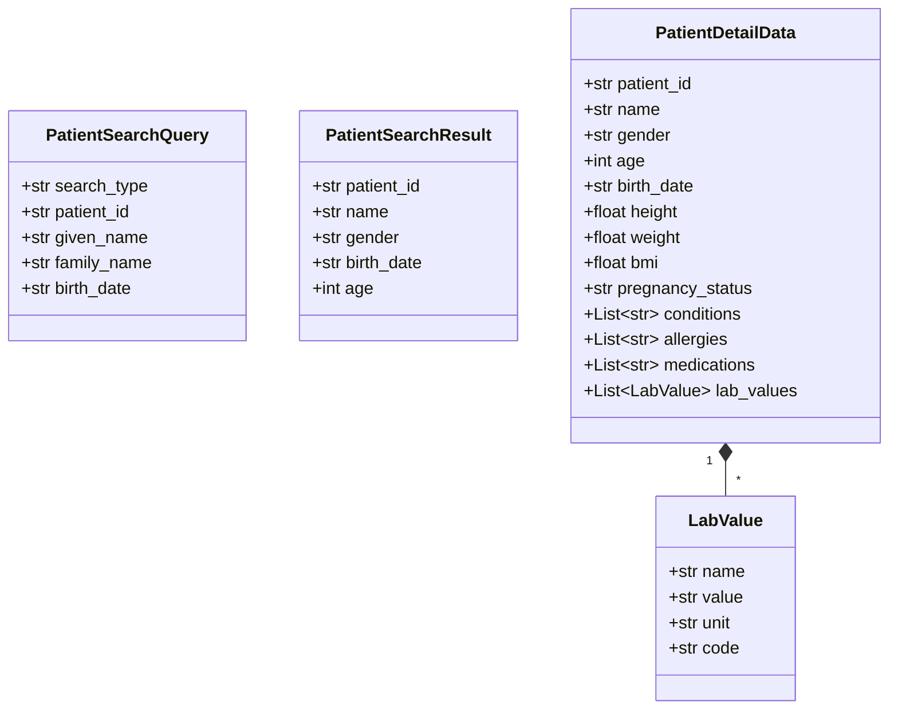
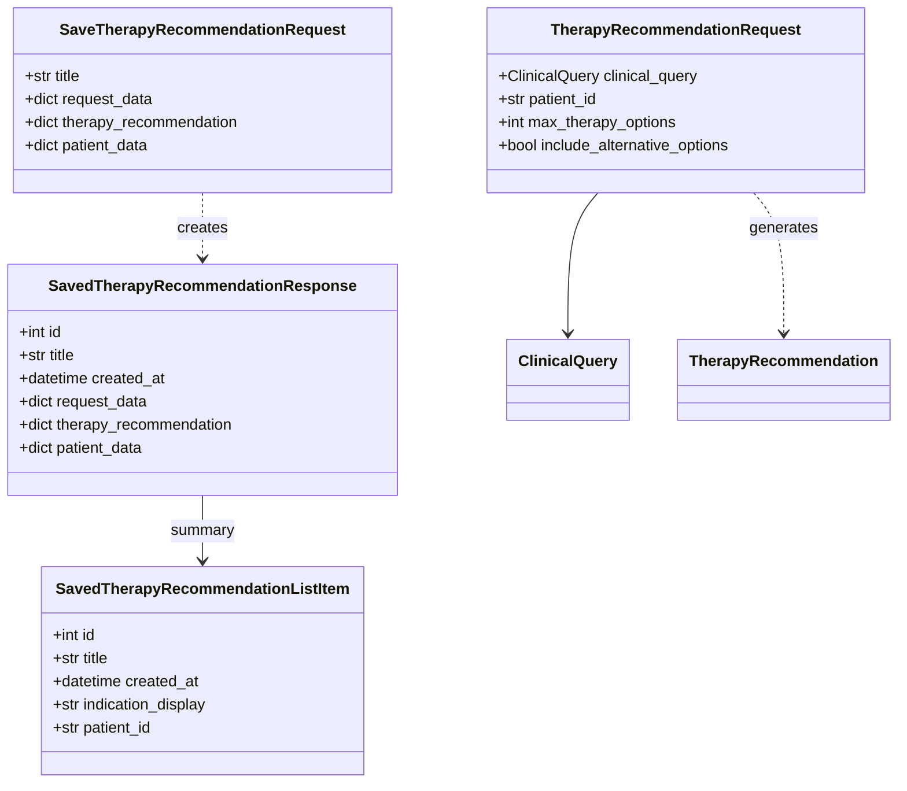
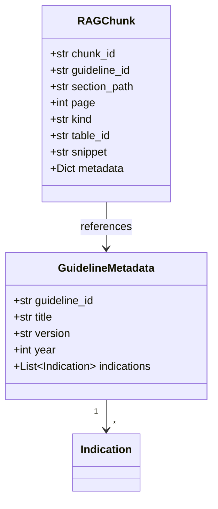

# ABS-CDSS Architektur-Diagramm

## Systemarchitektur mit Tech-Stack



````

## Datenfluss: Therapieempfehlung

```mermaid
sequenceDiagram
    participant UI as Enduser Frontend
    participant API as FastAPI
    participant CTX as Context Builder
    participant RAG as RAG Service
    participant FHIR as FHIR Service
    participant LLM as LLM Service
    participant EMB as Embedding Service
    participant FAISS as FAISS Index
    participant HAPI as HAPI FHIR
    participant Novita as Novita AI

    UI->>+API: POST /therapy/recommend<br/>{indication, severity, risk_factors, patient_id}

    API->>+CTX: build_therapy_context(query, patient_id)

    par Parallel Data Retrieval
        CTX->>+RAG: search(ClinicalQuery, top_k=5)
        RAG->>RAG: _build_search_query<br/>(MUST/SHOULD/BOOST)
        RAG->>+EMB: encode(search_text)
        EMB-->>-RAG: query_embedding
        RAG->>+FAISS: search(query_embedding)
        FAISS-->>-RAG: semantic scores + indices
        RAG->>RAG: _calculate_lexical_boost<br/>(+500/+50 per synonym)
        RAG->>RAG: combine semantic + lexical
        RAG->>RAG: _search_dosing_tables<br/>(+1000/+100 boost)
        RAG-->>-CTX: RAGResponse{results, dosing_tables}
    and
        CTX->>+FHIR: get_patient_bundle(patient_id)
        FHIR->>+HAPI: GET /Patient/{id}?_include=*
        HAPI-->>-FHIR: Bundle{Patient, Condition,<br/>Observation, Medication, Allergy}
        FHIR->>FHIR: parse_patient_data<br/>(LOINC codes, eGFR, demographics)
        FHIR-->>-CTX: PatientData
    end

    CTX->>CTX: _build_context_text<br/>(normalize scores to 0-1)
    CTX->>CTX: add additional_info<br/>(age>70, GFR≤60, MRGN)
    CTX-->>-API: context_data{context_text, patient, sources}

    API->>+LLM: generate_therapy_recommendation<br/>(context_data, max_options=5)
    LLM->>LLM: _build_system_prompt<br/>(JSON schema, German output)
    LLM->>LLM: _build_user_prompt<br/>(context_text + instructions)
    LLM->>+Novita: chat.completions.create<br/>{response_format: json_object}
    Novita-->>-LLM: JSON{therapy_options[], clinical_guidance,<br/>source_citations[], confidence_level}
    LLM->>LLM: _parse_llm_response<br/>(cleanup + Pydantic validation)
    LLM-->>-API: TherapyRecommendation

    API->>API: Transform to frontend format
    API-->>-UI: {therapy_options, clinical_guidance,<br/>source_citations, patient_data, confidence_level}

    UI->>UI: Display TherapyResults<br/>(Relevanz: score×100%)
````

## RAG Query Construction

```mermaid
flowchart LR
    subgraph "Input: ClinicalQuery"
        IND[indication:<br/>AMBULANT_ERWORBENE_PNEUMONIE]
        SEV[severity:<br/>SCHWER]
        RISK[risk_factors:<br/>MRGN_VERDACHT]
        SITE[infection_site:<br/>LUNGE]
        PATH[suspected_pathogens:<br/>MRSA]
        FREE[free_text:<br/>additional notes]
    end

    subgraph "Query Builder"
        MUST["MUST Terms<br/>- Indication synonyms<br/>- Severity synonyms<br/>Example: 'CAP', 'Pneumonie',<br/>'ambulant', 'schwer'"]

        SHOULD["SHOULD Terms<br/>- Risk factor synonyms<br/>- Infection site synonyms<br/>- Pathogens<br/>Example: 'MRGN', 'ESBL',<br/>'pulmonal', 'MRSA'"]

        BOOST["BOOST Terms<br/>- Therapy anchors<br/>- Dosage keywords<br/>Example: 'Therapie',<br/>'Dosierung', 'Tabelle'"]
    end

    subgraph "Search Execution"
        CONCAT[Concatenate:<br/>MUST + SHOULD + BOOST + FREE]
        EMB[Embedding Service:<br/>encode to vector]
        FAISS1[FAISS Search:<br/>Guidelines Index<br/>IndexFlatIP]
        FAISS2[FAISS Search:<br/>Dosing Tables Index<br/>IndexFlatIP]
        LEX1[Lexical Boost:<br/>Chunks +500/+50]
        LEX2[Lexical Boost:<br/>Tables +1000/+100]
        SORT[Sort by final score<br/>Top-K per guideline]
    end

    IND --> MUST
    SEV --> MUST
    RISK --> SHOULD
    SITE --> SHOULD
    PATH --> SHOULD
    FREE --> CONCAT

    MUST --> CONCAT
    SHOULD --> CONCAT
    BOOST --> CONCAT

    CONCAT --> EMB
    EMB --> FAISS1
    EMB --> FAISS2

    FAISS1 --> LEX1
    FAISS2 --> LEX2

    LEX1 --> SORT
    LEX2 --> SORT
```

## Tech Stack Übersicht



## Deployment Architecture



## Komponenten-Interaktion



## Pydantic Datenmodelle

### Therapy Recommendation Modelle



### Query und RAG Modelle



### FHIR Patient Modelle



### Request/Response Workflow



### Guideline Metadata



---

**Legende:**

- **Blaue Boxen**: Frontend-Komponenten (React)
- **Gelbe Boxen**: API-Layer (FastAPI)
- **Violette Boxen**: Core Services (Python)
- **Grüne Boxen**: Datenschicht (Files, DB, FAISS)
- **Orange Boxen**: Externe Services (Novita, HAPI)
- **Rosa Boxen**: Deployment-Infrastruktur (Docker, Koyeb)
